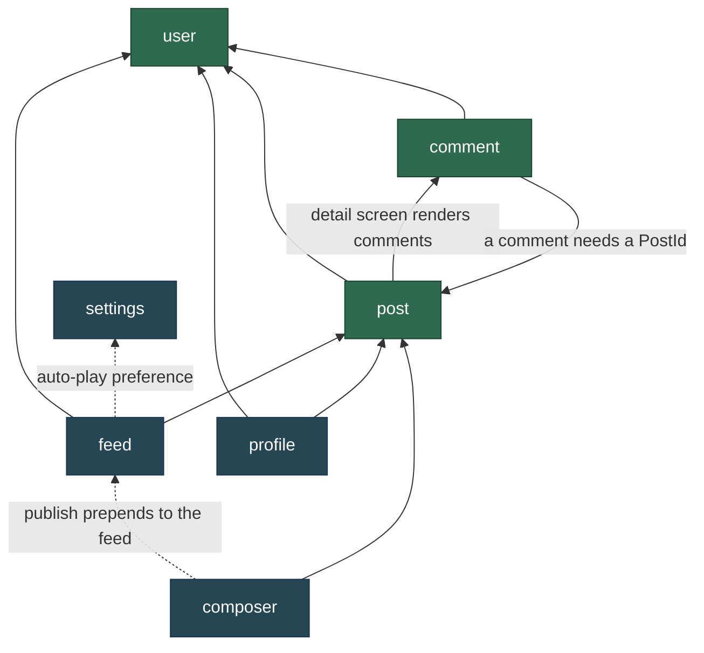
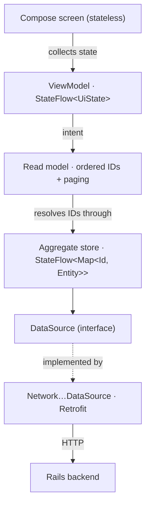
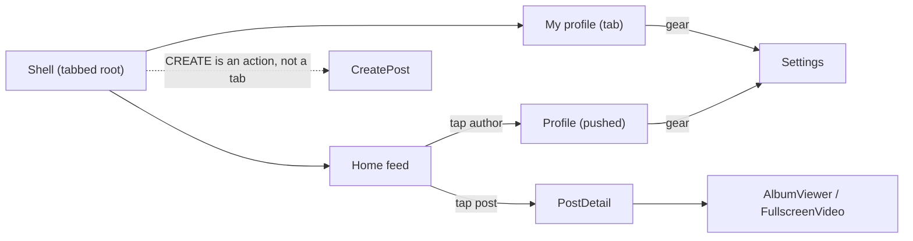

# Mosaic

A portfolio Android app demonstrating modern architecture: single-activity Compose UI, Navigation 3, Hilt DI, MVVM with `StateFlow`, and a Retrofit network layer talking to a Rails backend.

## Package layout

The top level is **slices, not layers** — layers are the shape *inside* a slice. There is no root `data/` or `ui/` package, and deliberately no `activities/`, `fragments/`, `viewmodels/` or `dialogs/`: **a file's home is decided by what it is *about*, never by what it extends.** Supertype is what the IDE indexes for you; it never needs a folder.

```
uno/lux/sample/
├── app/          the machine — MainActivity, MosaicApplication, di/, navigation/, the shell
├── design/       theme/ and components/ that know no domain noun
├── core/         network/ plumbing, files/, state/ — would survive deleting the product
│
├── post/         ─┐
├── user/          ├─ aggregates: the entity, its wire types, its store, its UI
├── comment/      ─┘
│
├── feed/         ─┐
├── profile/       ├─ read models and features: they own no entity
├── composer/      │
├── settings/     ─┘
│
├── util/         pure functions with zero project imports
└── fixtures/     stand-in content for previews and DI seeding
```

Each slice carries its own layers: `post/Post.kt` is the entity, `post/data/` holds the repository and its `DataSource` **interface**, `post/data/network/` holds the Retrofit service, DTOs, mapper and the `Network…DataSource`, and `post/ui/` holds the screens. The interface lives beside its *consumer*, not beside its implementation — which is what would let a repository compose a network and a local source without either one owning the contract.

### Aggregates vs. read models

The distinction that keeps the dependency graph acyclic. `post`, `user` and `comment` own an entity and everything about it. `feed` and `profile` own no entity — they are read models holding an ordered list of IDs plus paging state, resolved through the aggregate stores. That is why liking a post in the feed updates it on a profile with no re-fetch, and why `ProfileRepository` *composes* `PostRepository` rather than duplicating it.



> Features may depend on aggregates. **Aggregates never depend on features.**

`user` and `settings` are leaves — they import nothing from another slice. The two dashed edges are feature-to-feature by design: publishing a post prepends it to the feed, and the feed honours the auto-play preference.

The one genuine cycle is `post ↔ comment`: a comment needs a `PostId`, and the post detail screen renders comments. Arguably `Comment` is not a separate aggregate root at all — it cannot exist without its post and is deleted with it, which is the definition of an entity *inside* the post aggregate. Folding `comment/` into `post/` would remove the cycle; it stays separate for now because nine files earn their own folder.

### Where does a new file go?

Ask in order — no two questions tie:

1. **Does it mention a domain noun?** No → 2. Yes → 3.
2. Pixels → `design`. Wires the app together → `app`. Neither → `core` / `util`.
3. Claimed by exactly one feature → that feature. By several → the noun's aggregate.

The cases that used to be ambiguous, resolved: `DiscardChangesDialog` names no noun and is shared by the composer and the profile editor → `design/components/`. `ReportDialog` knows `ReportReason` → `post/ui/`. `Avatar` renders a `User` → `user/ui/`, *not* `design/`. `FileLoader` reads content URIs and names nothing → `core/files/`. `relativeTime()` imports nothing of ours → `util/`.

There is **one Retrofit service per slice** (`FeedApi`, `PostApi`, `CommentApi`, `UserApi`, `ProfileApi`), all created from a single `Retrofit` instance. A single app-wide API interface is what the split replaced: it spanned five slices, so it belonged to none of them, and its 338-line test fake had to be implemented in full by every test that needed one endpoint.

## Architecture

Single-activity, 100% Jetpack Compose — no Fragments, no XML layouts. Data flows one way, and every seam is an interface a test can substitute.



- **MVVM + UDF** — each screen splits into a stateful binder that collects the `StateFlow` and injects the ViewModel, and a stateless inner composable taking data + callbacks. ViewModels and repositories are plain-JVM with constructor-injected dependencies, so tests drive them directly and never touch Hilt.
- **One source of truth** — each aggregate repository is a `@Singleton` holding a `StateFlow<Map<Id, Entity>>`. A mutation replaces one entry and emits atomically to every collector, so a like toggled in the feed is instantly visible on a profile. Because the map preserves the *same instance* for untouched entries, Compose skips every row but the one that changed.
- **Navigation intent flows through ViewModels**, not host lambdas — every screen injects a `Navigator` and calls `goTo` / `goBack` itself, so the app composable wires no navigation callbacks at all.

### Navigation

A serializable back stack of `Screen` keys, so it survives configuration changes *and* process death. `Shell` is the permanent tabbed root; everything else pushes on top as a full-screen page.



Because a restarted process rebuilds every repository from scratch, a screen must be able to redraw itself from its `Screen` key alone — which is why `AlbumViewer` carries its image URLs and `PostDetail` re-fetches on a cold start.

## Backend

The app talks to a Rails backend at `https://mosaic.tree-among-shrubs.com/api/`, configured in `app/di/NetworkModule.kt`. There is no sign-in: the current user is seeded from `fixtures/SampleData.kt` and sent as an `X-User-Id` header, which the server uses to scope viewer state (`isLiked`, `isBookmarked`) and to enforce ownership on deletes and private bookmark reads.

## Testing

Tests are the primary consumer of this codebase — the architecture is shaped by what a test needs to drive. 354 JVM unit tests cover repositories, ViewModels and formatters with hand-written fakes; instrumented tests cover the two things a JVM test cannot reach, saved-state restoration and process death.

Four of those are **architecture tests**. `ArchitectureTest` (Konsist) reads every import in the project and fails the build if one crosses a line the layout forbids — the foundation reaching into a slice, an aggregate importing a feature, HTTP escaping the network layer, or a repository picking up an Android dependency. Kotlin has no package-private and `internal` is module-scoped, so in a single-module project a package layout is a convention until something checks it. This is that something.

```bash
./gradlew testDebugUnitTest
```
