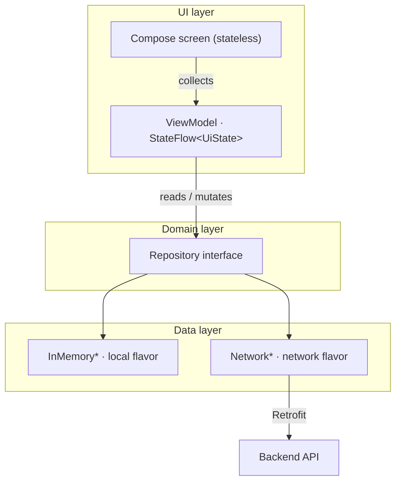
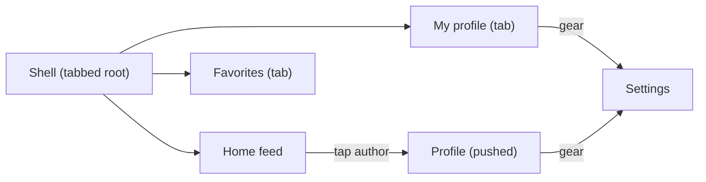

# Mosaic

A portfolio Android app demonstrating modern architecture: single-activity Compose UI, Navigation 3, Hilt DI, MVVM with `StateFlow`, and a Retrofit network layer.

## Data flavors

The app has two product flavors in the `data` dimension that control where repository data comes from.

| Flavor | Data source | Use when |
|--------|------------|----------|
| `local` **(default)** | In-memory, seeded from `SampleData.kt` | Running the app without a backend |
| `network` | Retrofit, hitting the dev server at `http://10.0.2.2:3000/api/` | Testing against a real backend |

## Backend setup (network flavor only)

The network flavor expects a server at `http://10.0.2.2:3000/api/` — the standard Android emulator address for `localhost` on the host machine. Start the backend on your machine at port 3000, then launch an emulator and install the `networkDebug` variant.

## Architecture

Single-activity, 100% Jetpack Compose. Three layers with a clean interface boundary between each.

- **MVVM + UDF** — each screen splits into a stateful binder that collects the `StateFlow` and a stateless inner composable that takes data and callbacks; ViewModels and repositories are plain-JVM with constructor-injected dependencies so tests drive them directly without Hilt
- **One source of truth** — state lives in a `MutableStateFlow` inside each singleton repository; a mutation emits a new list to every collector atomically

### Navigation

Navigation manages a serializable back stack of `Screen` keys. `Shell` is the permanent root; Other screens push on top as full-screen pages.

